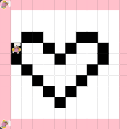

# asphalt-art-project
An image of a heart Icon using JavaLab.
# Unit 1 - Asphalt Art

## Introduction

Cities use asphalt art to improve public safety, inspire their residents and visitors, and brighten communities. Your goal is to create asphalt art to revitalize The Neighborhood and bring the community together with the help of the Painter.

## Requirements

Use your knowledge of object-oriented programming, algorithms, the problem solving process, and decomposition strategies to create asphalt art:
- **Create a new subclass** – Create at least one new subclass of the PainterPlus class that is used for a component of the asphalt art design.
- **Plan an algorithm** – Use the problem solving process and decomposition strategies to plan an algorithm that incorporates a combination of sequencing, selection, and/or iteration.
- **Write a method** – Write at least one method in a PainterPlus subclass that contributes to a component of the asphalt art design.
- **Document your code** – Use comments to explain the purpose of the methods and code segments.

## Notes: Neighborhood & Painter Class

This project was created on Code.org's JavaLab platform using the built-in Neighborhood GUI output. To test and edit this project you must build in Code.org's JavaLab with the Neighborhood GUI enabled. For reference to the Painter class documentation, [you can read more here.](https://studio.code.org/docs/ide/javalab/classes/Painter)

## Output:

## Reflection

1. Describe your project.

   - I decided to create an image of the general "Image" that you see online sometimes when an image is not displayed. The "Image" icon depicts a black heart, white background, and a frame.

2. What are two things about your project that you are proud of?

   - I am mostly proud about the actual heart itself. It took many tries to get the heart outline to go the correct direction, but once I finally figured out the pattern, it was super easy. Watching it all come togther also made me proud of my work.

3. Describe something you would improve or do differently if you had an opportunity to change something about your project.

   - If I had the opportunity to change something about my project, I would do a bigger grid. This is because since the heart is kind of big, it does not fully fit in the 12x12. When you look at the finished product you can see how it is not centered because of the size of the heart.